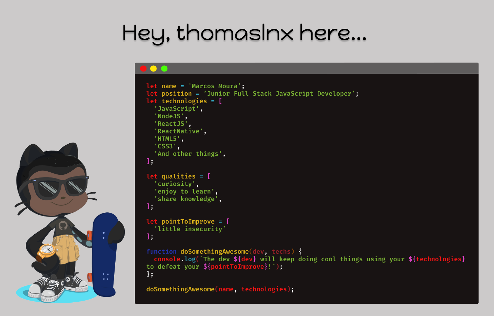

<!--  -->

         
## 📋  **More Aboute Me**

> I'm a JavaScript Full-Stack Engineer
>experienced in ReactJS, NextJS, NodeJS, TypeScript, GraphQL, REST Api. Also, I like to learn somethings
>besides that ones which I work like C language and
>to play with Arduino. I have experience working asynchronous with international team using english as main language.

## 🛠 **Main Languages**

 
 
 
 
 

## 🛠 **Tools**

- Docker-Compose;
- Docker;
- MongoDB;
- PostgreSQL;
- GraphQL;
- RestAPI;

## 🌎 **Where to find me**
 
[[][linkedin]]
[][gmail]
[][twitter]

[linkedin]: https://www.linkedin.com/in/marcos-de-moura-silva/
[twitter]: https://twitter.com/thomaslnx
[gmail]: mailto:marcos.msilva10@gmail.com
